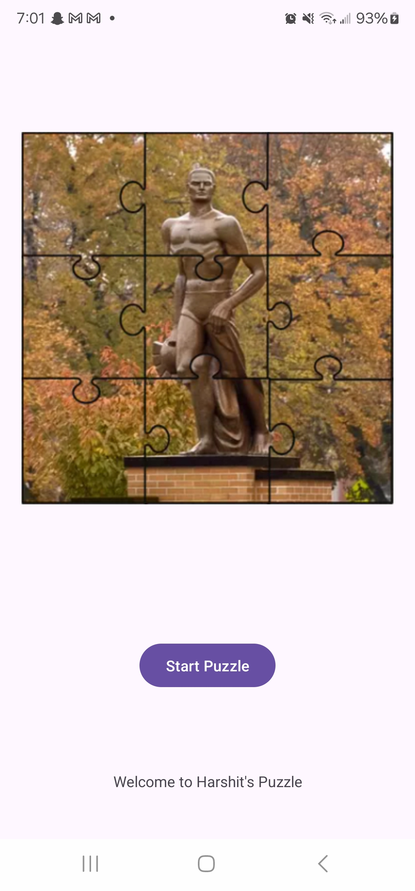
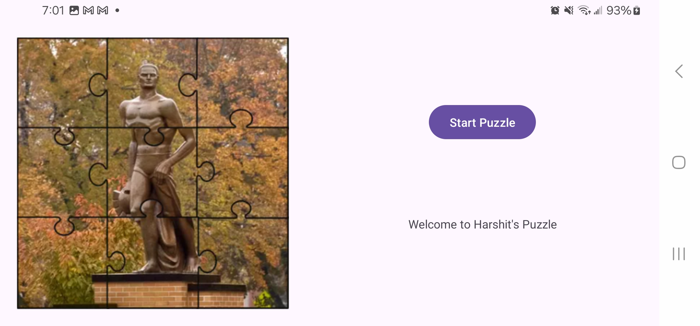
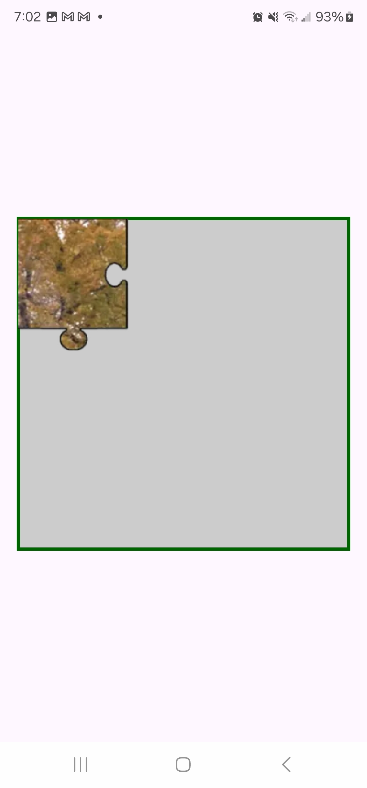
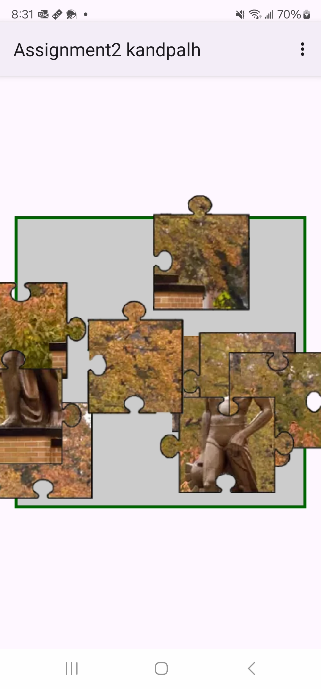
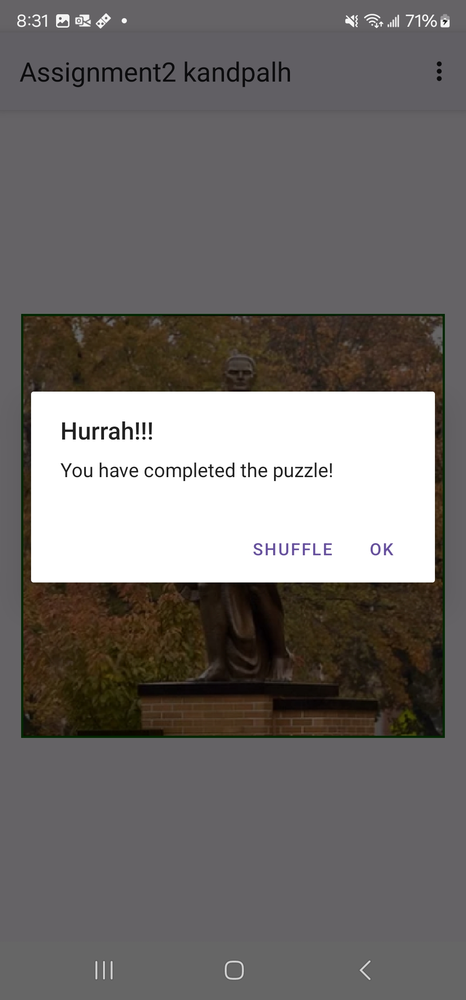

# Puzzle App

An interactive puzzle game for Android, built with Java and the Android SDK.

## Project Overview
Puzzle App is a mobile puzzle game developed for Android devices. The app challenges users with engaging puzzles, wrapped in a clean, interactive UI. Designed with performance and responsiveness in mind, it ensures a smooth experience across various screen sizes and orientations.

## Features (Planned & Implemented)
- **Puzzle Mechanics** – Fully functional core logic for solving tile-based puzzles.
- **User Interface** – Intuitive and responsive UI for a seamless experience.
- **Animations** – Smooth transitions and visual feedback to enhance gameplay.
- **Optimized Performance** – Runs efficiently on a wide range of Android devices.
- **Portrait & Landscape Support** - Adaptive layouts for different orientations.

## Technologies Used
- Java
- Android SDK
- Android API
- XML (for UI layouts)
- Gradle

## Screenshots











## How to Run
1. Clone the repository:
   ```sh
   git clone https://github.com/HarshitK150/puzzle-app.git
   ```
2. Open the project in Android Studio.
3. Connect a device or start an emulator.
4. Click Run to build and launch the app.
